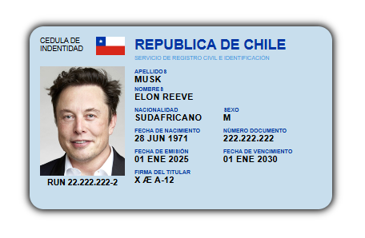

# **WEB COMPONENTS AND VUE JS CHALLENGE**

This project focuses on building a Vue.js application using Vite to showcase the interpolation of state variables in a template. It transforms a static HTML and CSS ID card design into a dynamic component by defining key variables in the component's state and interpolating them into the card template.


## **Technologies Used**
- **Vue.js**
- **Vite**
- **HTML5**
- **CSS3**


## **Features**
- **Dynamic State Management**: Uses variables like RUN, Name, Nationality, and more to create a personalized ID card.
- **Template Interpolation**: Displays state variables dynamically in the card template.
- **Responsive and Modular Design**: Ensures a clean structure adhering to Vue.js practices.


## **Screenshots**
<p align="center"></p>


## **Installation**
1.	Start proyect
```bash
npx vite
